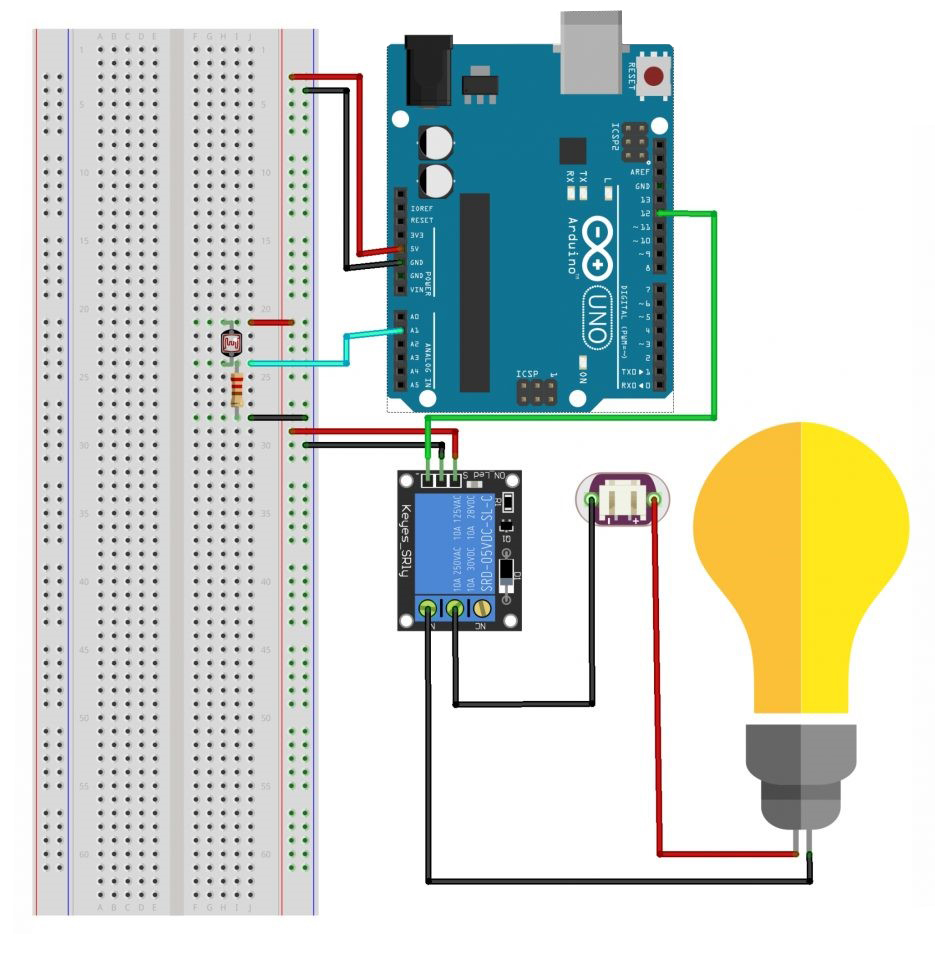

# Auto Light on Arduino Uno

## Description:

- LDR (Light Dependent Resistor) is a resistor component whose resistance value will change according to the intensity of light that hits this sensor. This sensor can be used for home lighting, streets, parks and others.

## Component (Tools & Materials):

• Arduino Uno = 1 unit;
• Sensor LDR = 1 unit;
• Resistor 220Ω = 1 unit;
• Breadboard = 1 unit;
• Relay 5V = 1 unit;
• Lampu 220V = 1 unit;
• Sumber listrik = 220V AC.

## Circuit Schematic:



## Sketch Code Program:

```cpp
/* Program Auto Lights (LDR) with Arduino Uno */

byte pinLDR = A1;
byte pinLampu = 12;
int lampuON = HIGH;
int lampuOFF = LOW;
int nilai;

void setup() {
    Serial.begin(9600);
    pinMode(pinLampu, OUTPUT);
    digitalWrite(pinLampu, lampuOFF);
}

void loop() {
    nilai = analogRead(pinLDR);
    Serial.println(nilai);

    if (nilai < 180) {
        digitalWrite(pinLampu, lampuON);
    }
    else {
        digitalWrite(pinLampu, lampuOFF);
    }
    delay(500);
}

```

## Conclusion:

- If the intensity of sunlight hitting this sensor decreases, the output from the LDR will be read by the Arduino and the lighting will activate itself and vice versa, if the intensity of sunlight hitting this sensor increases, then the output from the LDR will be read by the Arduino and the lighting will turn itself off. .
